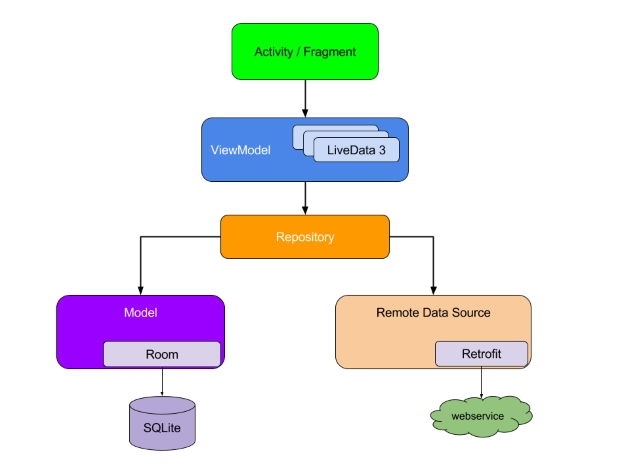

# Android Architecture Components  

<p align="center">
  
</p>

## What are Architecture Components?
[Architecture Components](https://developer.android.com/topic/libraries/architecture/index.html) is a new library by Google that has the aim to help us design application that are “robust, testable, and maintainable”. In a nutshell, this library helps us to better handle the persisting of data across lifecycle events and configuration changes, whilst also helping us to create a better architecture application and avoid bloated classes that are difficult to maintain and test.

## The basic blocks


### The basic blocks of the architecture components include the following:

- [Room](https://developer.android.com/topic/libraries/architecture/room.html) – A SQLite object mapper. Very similar to other libraries such as ORMlite or greenDAO. It uses SQL while still allowing compile time guarantees on the queries.
- [LiveData](https://developer.android.com/reference/android/arch/lifecycle/LiveData.html) – A Lifecycle aware observable core component.
- [ViewModel](https://developer.android.com/reference/android/arch/lifecycle/ViewModel.html) – The communication points with the rest of the application for Activities / Fragments. They are UI code free and outlive the activity or fragment.
- [Lifecycle](https://developer.android.com/reference/android/arch/lifecycle/Lifecycle.html) – A core part of the Architecture components, it contains information about the lifecycle state of a component (for instance an Activity).
- [LifecycleOwner](https://developer.android.com/reference/android/arch/lifecycle/LifecycleOwner.html) – Core interface for components that have a Lifecycle (Activities, Fragments, Process, your custom component).
- [LifecycleObserver](https://developer.android.com/reference/android/arch/lifecycle/LifecycleObserver.html) – Specifies what should happen when certain Lifecycle methods are triggered. Creating a LifecycleObserver allows components to be self-contained


## Sample

Simple Android App using geonames API http://www.geonames.org

### Effect


## Library reference resources
- [Room](https://developer.android.com/topic/libraries/architecture/room.html) 
- [Lifecycle](https://developer.android.com/reference/android/arch/lifecycle/Lifecycle.html)
- [Support library](https://developer.android.com/topic/libraries/support-library/index.html)
- [RxJava2](https://github.com/ReactiveX/RxJava), [RxAndroid](https://github.com/ReactiveX/RxAndroid) and [RxBindings](https://github.com/JakeWharton/RxBinding)
- [Retrofit2](http://square.github.io/retrofit/)
- [Okhttp3](https://github.com/square/okhttp/)
- [Fresco - A powerful image downloading and caching library for Android](https://github.com/facebook/fresco/)


# License
```                                  
   Copyright 2017 Igor Gavrilyuk

   Licensed under the Apache License, Version 2.0 (the "License");
   you may not use this file except in compliance with the License.
   You may obtain a copy of the License at

       http://www.apache.org/licenses/LICENSE-2.0

   Unless required by applicable law or agreed to in writing, software
   distributed under the License is distributed on an "AS IS" BASIS,
   WITHOUT WARRANTIES OR CONDITIONS OF ANY KIND, either express or implied.
   See the License for the specific language governing permissions and
   limitations under the License.
```
